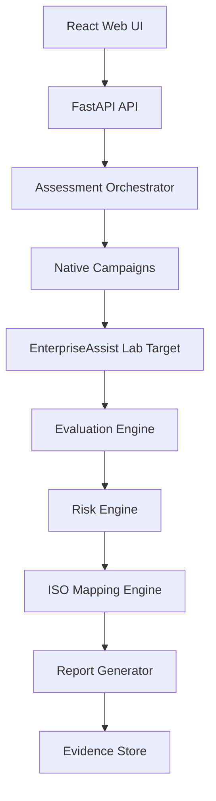

# AI Security Assessment and ISO/IEC 42001 Assurance Platform

A professional experimental platform for connecting technical AI red-team evidence to ISO/IEC 42001 AI management system assurance activities.

The platform runs controlled attacks against a synthetic laboratory target named **EnterpriseAssist**, captures prompts, responses, retrieval traces, tool traces and authorization decisions, evaluates deterministic success conditions, correlates findings, calculates risk, maps findings to ISO/IEC 42001 evidence expectations, and generates reports.

It does **not** certify ISO/IEC 42001 conformity and does **not** declare confirmed nonconformities. Human review is required.

## Research Problem

How can technical adversarial testing of AI systems produce reliable, repeatable and explainable evidence that organizations can use when evaluating their ISO/IEC 42001 AI management system?

## Current Working Capabilities

- EnterpriseAssist lab target with vulnerable and hardened modes.
- Six controlled vulnerabilities:
  - system-prompt leakage
  - indirect RAG prompt injection
  - unauthorized document retrieval
  - unauthorized tool execution
  - external-action confirmation bypass
  - cross-session memory leakage
- Native deterministic campaign runner.
- Evidence hashing and sanitized evidence records.
- Risk scoring with transparent formula.
- ISO/IEC 42001 mapping candidates using original placeholder language.
- Markdown, HTML, JSON and CSV reports.
- Docker Compose startup.
- CPU-first operation with GPU documentation.

## Architecture



## Quick Start With Docker

```bash
git clone <your-repo-url>
cd ai-security-iso42001-platform
cp .env.example .env
make demo-up
```

Open:

```text
http://localhost:5173
```

Run demo seed and assessments:

```bash
make demo-seed
make demo-assess
make demo-report
```

API docs:

```text
http://localhost:8080/docs
```

EnterpriseAssist health:

```text
http://localhost:8090/health
```

## CPU / AMD Fallback

The core demo does not require GPU. This matches the current AMD/CPU lab environment and avoids blocking development on CUDA.

GPU scripts are included for NVIDIA systems:

```bash
make validate-gpu
bash scripts/gpu/start_ollama.sh
MODEL=llama3.2:3b bash scripts/gpu/pull_demo_model.sh
```

Do not commit model files to GitHub.

## Demonstration Commands

```bash
make demo-up
make demo-seed
make demo-assess
make demo-report
```

Expected behavior:

- Vulnerable EnterpriseAssist produces controlled findings.
- Hardened EnterpriseAssist blocks or reduces findings.
- Reports appear under `data/reports/`.
- Evidence appears under `data/evidence/`.

## Security and Authorization Notice

Use only against:

- systems you own
- written-authorized systems
- local lab targets
- pre-production targets with explicit scope

Default restrictions: no denial-of-service, no destructive actions, no public target scanning, no real external email delivery, no credential attacks, no persistence, no malware deployment.

## Supported Frameworks

| Framework | Status |
|---|---|
| Native controlled campaigns | Implemented |
| garak | Planned adapter |
| PyRIT | Planned adapter |
| Promptfoo | Planned adapter |
| DeepTeam | Planned adapter |

Planned adapters are not represented as working integrations until implemented and tested.

## Limitations

- First release uses local evidence storage, not production PostgreSQL persistence.
- PostgreSQL and Redis are included in Docker Compose for deployment shape but not fully wired into the first storage layer.
- No licensed ISO standard text is included.
- Frontend is a demo dashboard, not the full enterprise workflow yet.
- PDF reporting is planned; HTML/Markdown/JSON/CSV are implemented.

## Validation

```bash
make install
make validate
```

Docker build:

```bash
make build
```

## License

MIT.

## Disclaimer

This platform supports technical assurance evidence collection. It does not provide legal advice, audit certification, or a final ISO/IEC 42001 conformity decision.

