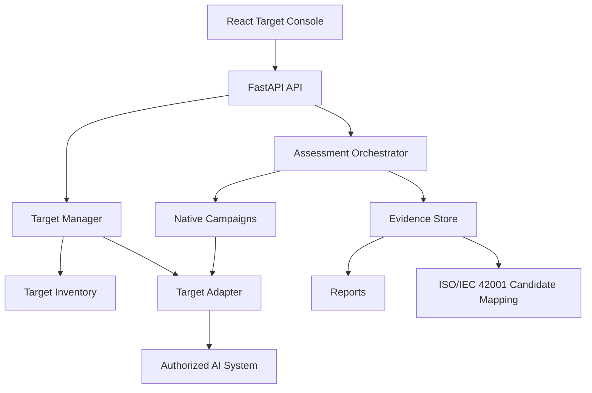

# AI Security Assessment and ISO/IEC 42001 Assurance Platform

A professional authorized AI security assessment platform for collecting technical evidence and mapping findings to ISO/IEC 42001 assurance activities.

The platform registers approved AI systems, validates target connectivity, discovers capabilities, runs controlled campaigns through target adapters, stores prompt/response/telemetry evidence, correlates findings, maps ISO/IEC 42001 evidence candidates, and generates Markdown/HTML/JSON/CSV reports.

It does **not** certify ISO/IEC 42001 conformity and does **not** declare legal compliance or final nonconformity. Human review is required.

## What changed in Phase 3

- General target inventory and target manager.
- Target adapter abstraction independent from assessment frameworks.
- EnterpriseAssist, OpenAI-compatible, vLLM, Ollama and Custom REST adapters.
- Safe URL/network validation with local-lab allowlisting.
- Credential masking and development encryption.
- Capability discovery and black/grey/white-box visibility classification.
- Frontend workflows for target registration, validation, assessment launch, evidence, ISO mapping and reports.
- Native campaigns now run through the target abstraction.
- Local OpenAI-compatible and Custom REST fixture endpoints for validation.

## Architecture



## Quick Start

```bash
git clone https://github.com/xorai-sec/AI-Security-Assessment-Platform.git
cd AI-Security-Assessment-Platform
cp .env.example .env
make demo-up
```

Open:

```text
Dashboard: http://127.0.0.1:5173
API docs:  http://127.0.0.1:8080/docs
Target:    http://127.0.0.1:8090/health
```

Register and assess controlled targets:

```bash
python3 -m venv .venv
source .venv/bin/activate
make install
make register-enterprise-assist
make register-openai-fixture
make register-custom-rest-fixture
make validate-targets
make assess-target
make assess-target-group
make demo-report
```

## Target support matrix

| Target type | Status | Capabilities |
|---|---|---|
| EnterpriseAssist | Implemented and locally tested | RAG, tools, memory, white-box telemetry |
| OpenAI-compatible | Implemented; local fixture added | Chat, multi-turn, model metadata, token usage where returned |
| Ollama | Implemented; runtime validation required | Local model chat, model availability |
| vLLM | Implemented through OpenAI-compatible adapter; runtime validation required | OpenAI-compatible local serving |
| Custom REST | Implemented; local fixture added | Configurable request/response and optional telemetry |
| Generic RAG | Implemented with telemetry-dependent features | Chat and optional retrieval evidence |
| Generic Agent | Implemented with telemetry-dependent features | Chat and optional tool/action evidence |

## Framework support

| Framework | Status |
|---|---|
| Native controlled campaigns | Implemented through target adapters |
| garak | Isolated worker implemented; Ubuntu Docker validation pending |
| PyRIT | Isolated worker implemented; Ubuntu Docker validation pending |
| Promptfoo | Isolated Node worker implemented; Ubuntu Docker validation pending |
| DeepTeam | Isolated worker implemented; Ubuntu Docker validation pending |

Run framework workers:

```bash
make install-frameworks
make up-frameworks
make framework-health
make framework-self-test
make assess-all
```

## URL safety

The platform rejects unsupported schemes, cloud metadata IPs, link-local/multicast/unspecified addresses, unapproved ports and non-allowlisted local/private destinations. Docker local lab mode permits `enterprise-assist`, `localhost`, `ollama` and `vllm` through administrator environment settings.

## CPU and GPU

The core assessment platform runs CPU-first and works on the AMD/CPU lab environment. Optional Ollama/vLLM deployment patterns are documented under `docs/deployment/`.

## Reports and evidence

Reports are generated under `data/reports/`; evidence is stored under `data/evidence/`. API report links:

```text
/api/reports/{assessment_id}/markdown
/api/reports/{assessment_id}/html
/api/reports/{assessment_id}/json
/api/reports/{assessment_id}/csv
```

## Known limitations

- Persistence is file-backed; PostgreSQL/Alembic is not wired yet.
- Initial PostgreSQL/Alembic schema exists, but application repositories are still file-backed.
- Redis workers, cancellation and live event streaming are not wired yet.
- External framework workers require Ubuntu Docker validation before client testing.
- Development credential protection must be replaced before enterprise deployment.
- PDF and evidence package export are planned.

## Documentation

- `docs/PHASE3_GENERAL_TARGET_ASSESSMENT_PLAN.md`
- `docs/PHASE3_FINAL_BUILD_REPORT.md`
- `docs/PHASE3_TARGET_SUPPORT_MATRIX.md`
- `docs/PHASE3_RELEASE_BLOCKERS.md`
- `docs/security/SSRF_PROTECTION.md`
- `docs/demo/CLIENT_PRESENTATION_SCRIPT.md`

## Safety notice

Use only against systems you own or have written authorization to assess. Do not use for denial-of-service, credential attacks, infrastructure exploitation, malware delivery, persistence or destructive actions.

## License

MIT.
