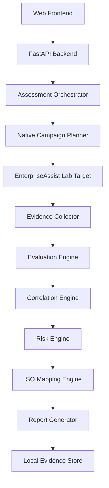

# Implementation Plan

> Historical planning document. DeepTeam references below are superseded and
> are not part of the active product.

## Current-State Summary

This is a new repository created as a separate project from the earlier
AI-Security-Assessment dashboard. No existing project folder was found at
`F:\ai-security-iso42001-platform` before initialization.

The previous project proved useful patterns:

- Hosted REST target testing.
- garak REST configuration concepts.
- Evidence transcript capture.
- ISO evidence mapping language.
- Ubuntu/RDP deployment experience.
- AMD/CPU reality for the current lab machine.

This repository is designed as a cleaner, production-oriented monorepo.

## Reusable Components

- Hosted-target assessment workflow concept.
- Redacted evidence transcript pattern.
- ISO/IEC 42001 evidence mapping methodology.
- Local Ollama model runner approach.
- Docker-friendly FastAPI services.

## Technical Debt Avoided

- No giant single-file dashboard.
- No fake successful attack records.
- No committed model weights.
- No direct arbitrary shell execution from user input.
- No claim of ISO certification or legal compliance.

## Missing Components After First Release

- PostgreSQL persistence and Alembic migrations.
- Redis-backed queue worker.
- Full role-based login implementation.
- garak/PyRIT/Promptfoo/DeepTeam production adapters.
- PDF rendering.
- Full frontend pages for every workflow.
- NVIDIA GPU validation in this local environment.

## Proposed Architecture

## Milestone Plan

1. Repository foundation, safety docs, Docker, Make commands.
2. EnterpriseAssist vulnerable/hardened target.
3. Native campaign runner and deterministic evaluation.
4. Evidence store, risk scoring, ISO mapping, report generation.
5. Minimal API and web UI for demo.
6. Tests and validation commands.
7. Framework adapters.
8. PostgreSQL/Redis production persistence.

## Assumptions

- Basic development must work without GPU.
- Current lab machine may use AMD/CPU fallback.
- A separate NVIDIA GPU deployment may be used later.
- ISO standard text is not embedded; only original mapping placeholders are used.

## Key Risks

- Framework dependency conflicts.
- Long-running attack campaigns.
- Incorrect claims about ISO conformity.
- Storing sensitive evidence.
- Confusing demo target behavior with production assurance.

Mitigation: clear statuses, controlled synthetic target, deterministic canaries,
evidence redaction, and explicit human-review fields.
