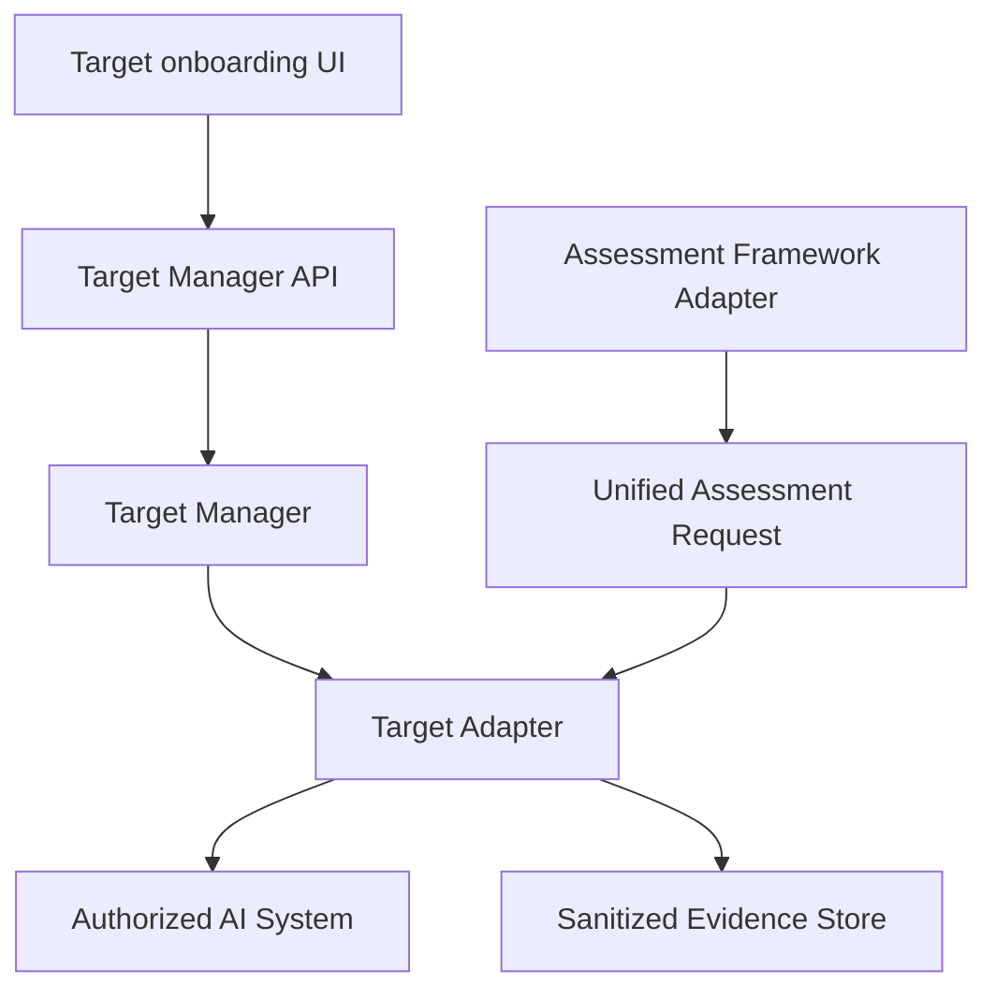

# Phase 3 General Target Assessment Plan

## Current working capabilities

- EnterpriseAssist vulnerable and hardened laboratory target.
- Six deterministic native campaigns.
- Evidence hashing, sanitized evidence records, risk scoring, ISO/IEC 42001 candidate mapping, and Markdown/HTML/JSON/CSV reports.
- Docker Compose startup with API, web, PostgreSQL, Redis, and EnterpriseAssist.
- Basic React frontend, now upgraded into a target-oriented console.

## Current incomplete capabilities

- PostgreSQL tables are present only as deployment shape; application persistence is still file-backed.
- Redis workers are not wired to execute background jobs.
- garak, PyRIT, Promptfoo, and DeepTeam are represented as planned framework adapters until real environment validation is completed.
- PDF reports and object-storage evidence packages are not implemented.

## Existing reusable code

- Native campaign definitions in `packages/security_assurance/campaigns.py`.
- Evaluation, evidence hashing, risk, ISO mapping, reporting, and storage modules.
- EnterpriseAssist target with white-box telemetry.

## Architectural weaknesses found

- Assessment execution was coupled directly to EnterpriseAssist client code.
- Target URLs were not represented as governed inventory objects.
- URL validation, capability discovery, credential masking, and target visibility were missing.
- Frontend navigation showed dashboard sections without real workflows.

## Target abstraction design

Framework adapters decide how to test. Target adapters decide how to communicate with the approved target.

## Supported target types in this phase

- EnterpriseAssist: implemented and locally tested through the adapter.
- OpenAI-compatible: implemented with real HTTP calls; tested against local fixture endpoint.
- vLLM: implemented through OpenAI-compatible adapter; environment validation pending.
- Ollama: implemented with `/api/tags` and `/api/chat`; requires local Ollama availability for validation.
- Custom REST: implemented with safe request templates and field-path extraction; tested against local fixture endpoint.
- Generic RAG/agent: represented through Custom REST with telemetry-dependent capabilities.

## Security restrictions

- Only HTTP and HTTPS schemes are accepted.
- Cloud metadata, link-local, multicast, unspecified, unsupported ports, and non-allowlisted local/private destinations are blocked by policy.
- Local laboratory hosts are allowlisted through administrator environment settings.
- Targets require authorization confirmation and kill-switch acknowledgement before launch.
- Production scopes remain blocked by default.
- Credentials are masked in API responses and protected with a development environment key.

## Database changes

File-backed target records are stored under `data/targets`. PostgreSQL/Alembic migration is a release blocker for enterprise readiness.

## API changes

Added target inventory, validation, health, discovery, test-message, supported-campaign, health-history, and target assessment endpoints.

## Frontend changes

Added live target registration, inventory, validation, capability discovery, target assessment launch, evidence transcript, ISO mapping, report links, and administration safety view.

## Framework integration changes

Native campaigns now execute through the target adapter abstraction. External framework workers remain blocked until framework environments are installed and validated.

## Migration plan

1. Keep EnterpriseAssist as a regression fixture.
2. Register EnterpriseAssist through the target manager.
3. Add OpenAI-compatible and Custom REST fixtures as non-EnterpriseAssist validation targets.
4. Migrate storage to PostgreSQL models and Alembic.
5. Add Redis worker execution and event streaming.
6. Add garak/PyRIT/Promptfoo/DeepTeam adapters through the target abstraction.

## Testing plan

- Unit tests for URL safety and target adapter contract utilities.
- Frontend production build.
- Python compile checks.
- Docker build and local API checks.
- Manual end-to-end validation on Ubuntu/RDP.

## Milestones

- Milestone 1: Complete and tested.
- Milestone 2: Complete and partially tested.
- Milestone 3: Complete and partially tested.
- Milestone 4: Complete and partially tested through local fixture.
- Milestone 5: Partially implemented.
- Milestone 6: Complete and partially tested through local fixture.
- Milestone 7: Complete but file-backed.
- Milestone 8: Complete and frontend build-tested.
- Milestone 9: Complete and partially tested.
- Milestones 10-16: Partially implemented or blocked as detailed in `PHASE3_IMPLEMENTATION_STATUS.md`.

## Acceptance criteria for this phase build

- Register a target.
- Validate URL/network policy.
- Health check target.
- Discover capabilities.
- Send a safe real test message.
- Run native campaigns through a target adapter.
- Persist evidence and reports.
- View findings/evidence/mapping/report links in the frontend.

