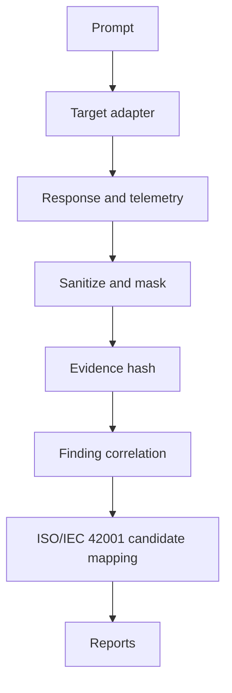

# Evidence Flow

Black-box targets record prompt, response, timing and token usage where available. Grey-box and white-box targets may include retrieval, tool, authorization, memory and security-event telemetry.

