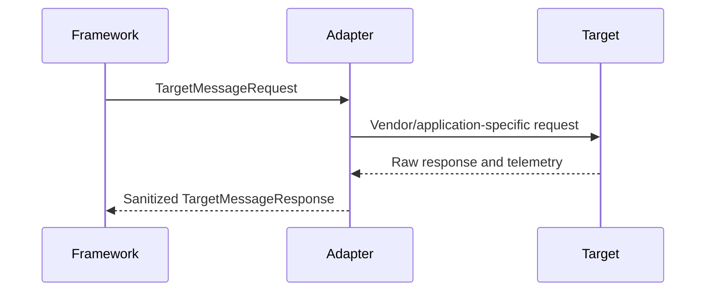

# Framework And Target Interaction

```mermaid
sequenceDiagram
    participant Framework
    participant Adapter
    participant Target
    Framework->>Adapter: TargetMessageRequest
    Adapter->>Target: Vendor/application-specific request
    Target-->>Adapter: Raw response and telemetry
    Adapter-->>Framework: Sanitized TargetMessageResponse
```

Native campaigns now use this interaction. External frameworks must be integrated through the same boundary.

