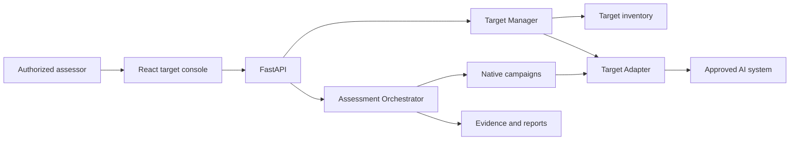

# General Target Architecture

```mermaid
flowchart LR
    User["Authorized assessor"] --> UI["React target console"]
    UI --> API["FastAPI"]
    API --> TM["Target Manager"]
    TM --> Inventory["Target inventory"]
    TM --> Adapter["Target Adapter"]
    Adapter --> Target["Approved AI system"]
    API --> Orchestrator["Assessment Orchestrator"]
    Orchestrator --> Native["Native campaigns"]
    Native --> Adapter
    Orchestrator --> Evidence["Evidence and reports"]
```

The target adapter boundary prevents framework code from embedding client-specific API logic.

