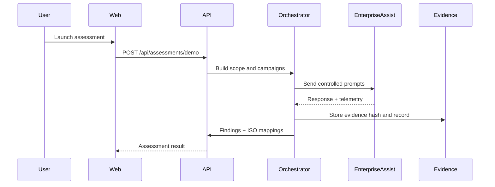

# System Architecture

The first release is a CPU-compatible controlled execution platform.

Future releases will replace local evidence storage with PostgreSQL/object storage
and add Redis-backed workers for long-running framework campaigns.

