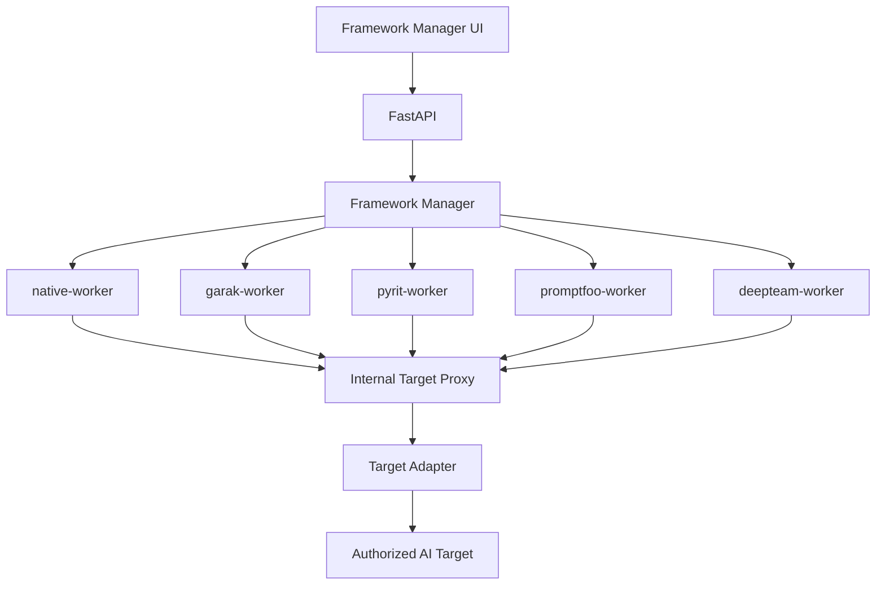

# Framework Execution Architecture

> Historical architecture. The DeepTeam node is retained for migration
> context only and is not deployed by the active product.

```mermaid
flowchart TD
    UI["Framework Manager UI"] --> API["FastAPI"]
    API --> Manager["Framework Manager"]
    Manager --> Native["native-worker"]
    Manager --> Garak["garak-worker"]
    Manager --> PyRIT["pyrit-worker"]
    Manager --> Promptfoo["promptfoo-worker"]
    Manager --> DeepTeam["deepteam-worker"]
    Native --> Proxy["Internal Target Proxy"]
    Garak --> Proxy
    PyRIT --> Proxy
    Promptfoo --> Proxy
    DeepTeam --> Proxy
    Proxy --> Adapter["Target Adapter"]
    Adapter --> Target["Authorized AI Target"]
```
